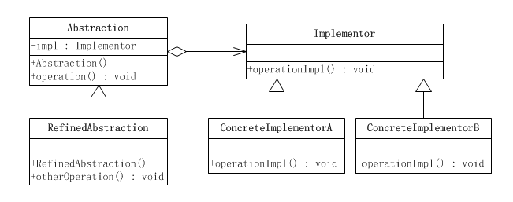
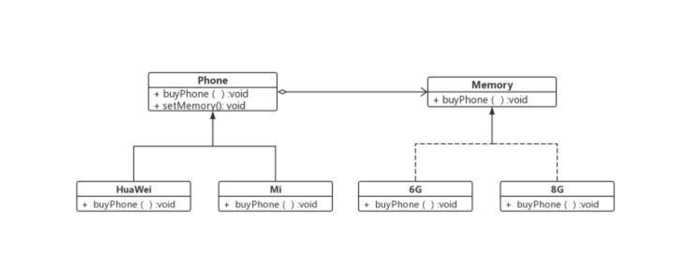

# 桥接模式

桥接模式是一种很实用的结构型设计模式，如果软件系统中某个类存在两个独立变化的维度，通过该模式可以将这两个维度分离出来，使两者可以独立扩展，让系统更加符合“单一职责原则”

例如手机有两个维度（其实不止）：品牌和内存

桥接模式类图：

桥接模式实例图：

基本上意思就是这，也就是我们买手机的时候有两个维度可供我们选择:一个是品牌一个是内存。

（1）client:指的是我们买手机的人。

（2）Abstraction（抽象类）：指的是手机抽象类

（3）Refined Abstraction（具体类）：指的是具体手机品牌

（4）Implementor：在这里相当于手机的其他组件，内存

（5）ConcreteImplementor：具体的内存型号。