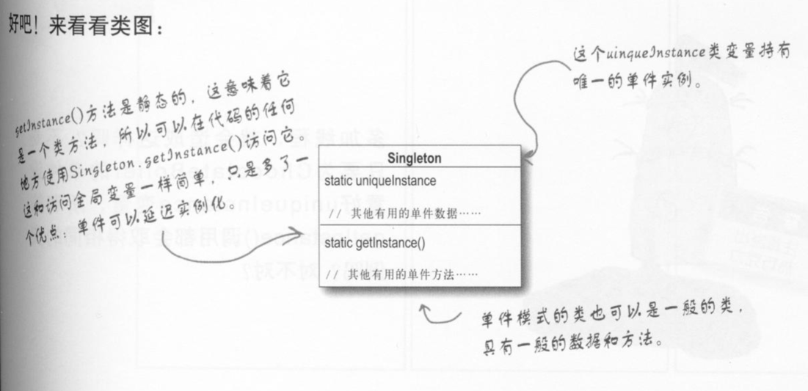
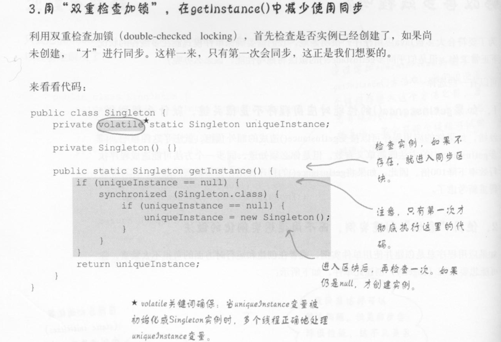
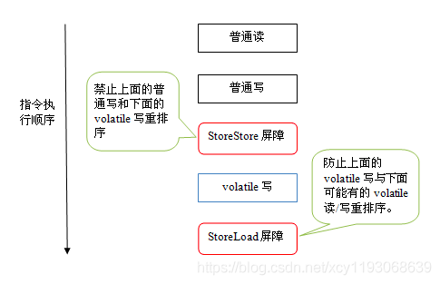
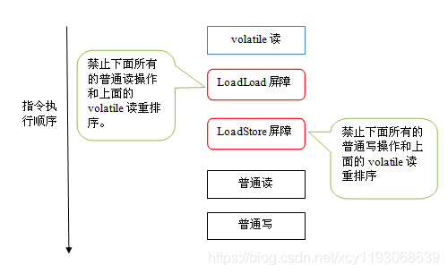

#  单例模式

确保一个类只有一个实例，并提供一个全局分访问点。

# 双重检查加锁

双重检查加锁可以减轻每次那对象时都加锁操作，提高效率。

# volatile 关键字的重要性

**在线程1中执行如下操作：**

在 uniqueInstance = new Singleton() 时，其执行的过程为：

1、new 关键词触发类加载机制（如果已经加载了就不会再次进行加载了）

2、分配内存空间

3、对象进行初始化

4、对象的引用地址赋值给栈空间中的变量

这里需要注意，如果没有加入 volatile 关键字， JVM中的JIT即时编译器会对代码的执行过程进行优化。

把过程变为：1 -> 2 -> 4 -> 3。

这样一个没有初始化完成的对象就可能给别的线程使用到。

**线程2**执行读 uniqueInstance 操作就会得到一个不完整的对象，但调用对象方法时就会报错了。

所以加上需要加上 volatile 来禁止指令的重排序。

根据类加载的东西，在多线程的条件下，**线程1**先执行getInstance()时，就会进行类加载，类的静态资源就会进行初始化。
根据JVM安全机制里说的，当一个类被JVM加载的时候，该类的加载是线程安全的，相当于JVM对该过程加锁了。所以整个过程处于一个锁的范围内，然后静态成员变量进行初始化就相当于 Singleton 创建并且完成初始化 ，只会被new一次。
当第二个线程进来，它就发现这个类已经被加载了，就不需要进行加载了，对象也不需要频繁创建，所以线程是安全的！

# volatile 详解

关键词 volatile 可以说是JVM提供的最轻量级的同步机制。当一个变量被定义为 volatile后，这个变量将具备2个特性：

1、保证这个变量对所有线程的可见性。这个可见性是指当一条线程改变了这个变量， 这个新值对于其他线程来说都是可以立马得知的。但并不意味着
基于volatile变量的运算在并发的环境下是线程安全的。

2、禁止指令重排序优化。用volatile修饰的变量，会使用内存屏障来制止指令重排序。

## 禁止重排序的实现

为了实现 volatile 的内存语义，编译器在生成字节码时，会在指令序列中插入内存屏障来禁止特定类型的处理器重排序。对于编译器来说，发现一个最优布置来最小化插入屏障的总数几乎不可能，为此，JMM 采取保守策略。下面是基于保守策略的 JMM 内存屏障插入策略：

1、在每个 volatile 写操作的前面插入一个 StoreStore 屏障。

2、在每个 volatile 写操作的后面插入一个 StoreLoad 屏障。

3、在每个 volatile 读操作的后面插入一个 LoadLoad 屏障。

4、在每个 volatile 读操作的后面插入一个 LoadStore 屏障。

volatile写过程：

volatile读过程：

# volatile 的问题：总线风暴

在java中使用unsafe实现cas,而其底层由cpp调用汇编指令实现的，如果是多核cpu是使用lock cmpxchg指令，单核cpu 使用compxch指令。  
如果在短时间内产生大量的cas操作在加上 volatile的嗅探机制则会不断地占用总线带宽，导致总线流量激增，就会产生总线风暴。总之，就是因为volatile 和CAS 的操作导致BUS总线缓存一致性流量激增所造成的影响。

